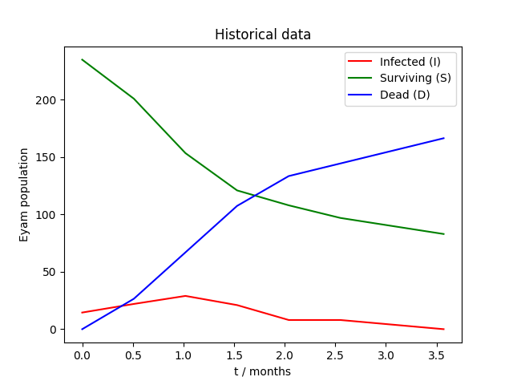
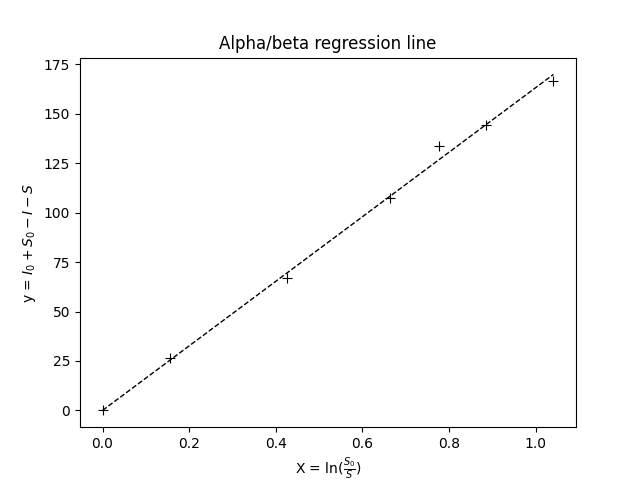
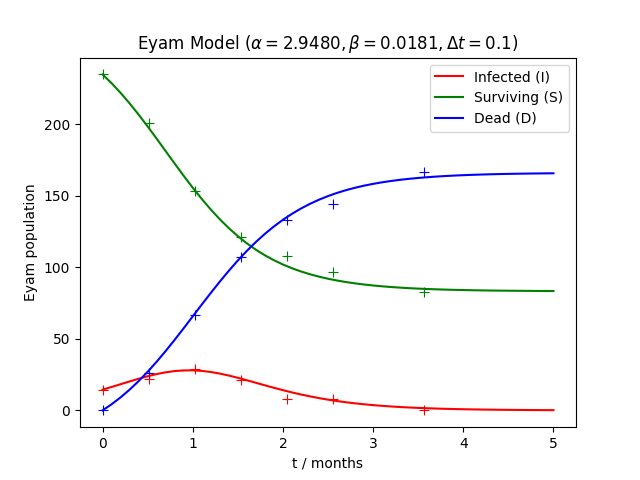
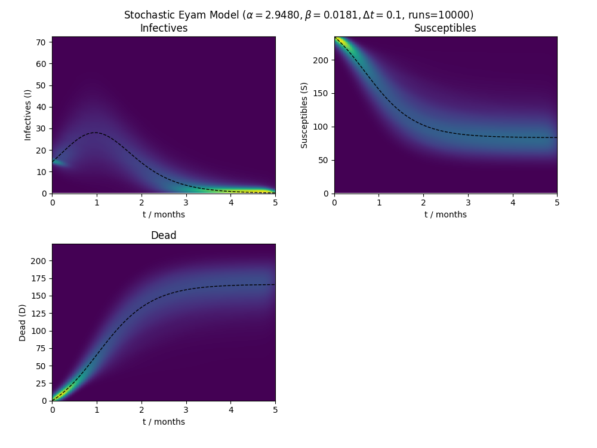

# The Epidemiology of Eyam

All credits for calculations go to Dr Andrew French, Winchester College.
http://www.eclecticon.info/index_htm_files/BPhO%20CompPhys%2011%20Epidemiology.pdf

---
## 0. Context
The [Plague of Eyam](https://en.wikipedia.org/wiki/Eyam#1665_plague_outbreak) in 1665, caused by the bacterium [Yersinia pestis](https://en.wikipedia.org/wiki/Yersinia_pestis), had 800 inhabitants of the Eyam village quarantined. 260 villagers died over a 14-month period. Rector [William Mompesson](https://en.wikipedia.org/wiki/William_Mompesson) recorded Infected ($I$), Susceptible ($S$) and Dead ($D$) populations. The data is as follows:
| Date | $t$ / months | $S$ | $I$ | $D$ |
| --- | --- | --- | --- | --- |
| July 3-4 1666 | 0.00 | 235 | 14.5 | 0 |
| July 19 1666 | 0.51 | 201 | 22 | 26.5 |
| Aug 3-4 1666 | 1.02 | 153.5 | 29 | 67 |
| Aug 19 1666 | 1.53 | 121 | 21 | 107.5 |
| Sept 3-4 1666 | 2.04 | 108 | 8 |  133.5 |
| Sept 19 1666 | 2.55 | 97 | 8 | 144.5 |
| Oct 20 1666 | 3.57 | 83 | 0 | 166.5 |



---
## 1. The Eyam Equations
The total population ( $I+S+D$ ) should remain constant.
```math
\begin{gather*}
I + S + D = I_0 + S_0 + \cancel{D_0} \\[5pt]
\frac{\textrm{d} I}{\textrm{d} t} + \frac{\textrm{d} S}{\textrm{d} t} + \frac{\textrm{d} D}{\textrm{d} t} = 0 \\[5pt]
\end{gather*}
```

The Eyam Equations state that
```math
\begin{cases}
\frac{\textrm{d} D}{\textrm{d} t} = \alpha I \\[5pt]
\frac{\textrm{d} S}{\textrm{d} t} = -\beta S I \\[5pt]
\frac{\textrm{d} I}{\textrm{d} t} = -\frac{\textrm{d} D}{\textrm{d} t} - \frac{\textrm{d} S}{\textrm{d} t} = \beta S I - \alpha I
\end{cases}
```
where $\alpha > 0$ and $\beta > 0$.

It is apparent that $\frac{\textrm{d} I}{\textrm{d} t} = 0$ when $I = 0$ or $I = \frac{\alpha}{\beta}$. By taking $I$ to the 2<sup>nd</sup> derivative, we find that $I$ is maximized when $S = \frac{\alpha}{\beta}$. We define this to be $\rho$, the susceptible threshold. When $S > \rho$, the epidemic grows; when $S < \rho$, the epidemic shrinks.
```math
\begin{align*}
	\frac{\textrm{d} I}{\textrm{d} t} & = (\beta S - \alpha)I \\[5pt]
	\frac{\textrm{d}^2 I}{\textrm{d} t^2} & = (\beta S - \alpha)\frac{\textrm{d} I}{\textrm{d} t} + (\beta \frac{\textrm{d} S}{\textrm{d} t})I \\[5pt]
		& = (\beta S - \alpha)^2 I - I^2 \beta^2 S \\[5pt]
	\frac{\textrm{d}^2 I}{\textrm{d} t^2}\bigg|_{S=\frac{\alpha}{\beta}} & = (\frac{\alpha}{\beta}\beta - \alpha)^2 - I^2 \beta^2 \frac{\alpha}{\beta} \\[5pt]
		& = -I^2\alpha\beta < 0
\end{align*}
```

---
## 2. Finding $\alpha$, $\beta$
We first find $\rho=\frac{\alpha}{\beta}$ by integrating $\frac{\textrm{d} I}{\textrm{d} S}$.
```math
\begin{align*}
	\frac{\textrm{d} S}{\textrm{d} t} & = -\beta S I \\[5pt]
	\frac{\textrm{d} I}{\textrm{d} t} & = \beta S I - \alpha I \\[5pt]
	\therefore \frac{\textrm{d} I}{\textrm{d} S} & = -\frac{\beta S I - \alpha I}{\beta S I} = \frac{\alpha}{\beta}\frac{1}{S}-1 = \rho \frac{1}{S} - 1 \\[5pt]
	\therefore I - I_0 & = \int_{S_0}^{S}\bigg(\rho \frac{1}{S} - 1\bigg) \textrm{d}S = \bigg[\rho \ln S - S\bigg]^S_{S_0} \\[5pt]
	\therefore I & = I_0 + \rho\ln\frac{S}{S_0} - S + S_0 \\[5pt]
	\therefore \rho\ln\frac{S}{S_0} & = I_0 + S_0 - I - S \\[5pt]
	y & = \rho x
\end{align*}
```



With the given data, we calculate $\rho \approx 163.29$ using linear regression.

We then choose $\alpha$ by minimizing squared error from the historical data.

This can be implemented by e.g. [Ternary search](https://en.wikipedia.org/wiki/Ternary_search) or simply running the model for a range of $\alpha$ values and choosing the minimum.

We find $\alpha \approx 2.9480$ and thus $\beta = \frac{\alpha}{\rho} \approx 0.0181$. Results are below:



Simulation is performed with an iterative numerical method. \+ markers represent Mompesson's data.

---
## 3. Stochastic eyam model
The changes to $S$, $I$ and $D$ are discrete & random. We can utilize this property & the Poisson distribution for our simulation.

If $k$ is the mean rate of an event occuring independently in a time period, then $\textrm{Po}(k)$ is a distribution that describes the probability of the number of events occuring within the same time period.

We have the following set of modified equations:

```math
\begin{cases}
\Delta D = \textrm{Po}(\alpha I \Delta t) \\[5pt]
\Delta S = \textrm{Po}(-\beta S I \Delta t) \\[5pt]
\Delta I = \textrm{Po}\big((\beta S I - \alpha I) \Delta t\big)
\end{cases}
```

By repeatedly running the model, we can generate a probability heatmap.

