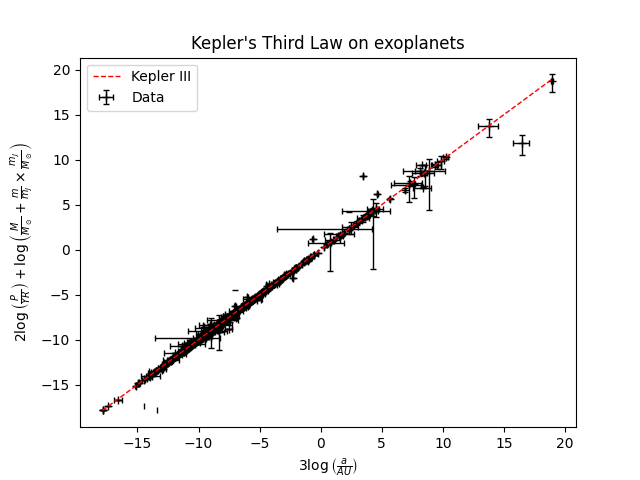

# Exoplanets and Kepler's Third Law

All credits for calculations go to Dr Andrew French, Winchester College.
http://www.eclecticon.info/index_htm_files/BPhO%20CompPhys%2006%20Planets.pdf

---

## 0. Table of contents
- [Exoplanets and Kepler's Third Law](#exoplanets-and-keplers-third-law)
	- [0. Table of contents](#0-table-of-contents)
	- [1. Kepler III in the Solar System](#1-kepler-iii-in-the-solar-system)
	- [2. Exoplanets](#2-exoplanets)

---
## 1. Kepler III in the Solar System
> Kepler's Third Law: the squares of the orbital periods of the planets are directly proportional to the cubes of the semi-major axes of their orbits. ([NASA](https://solarsystem.nasa.gov/resources/310/orbits-and-keplers-laws/))

We define the following symbols:
| Symbol | Name | Unit | Description |
| --- | --- | --- | --- |
| $P$ | Orbital period | $\textrm{days}$ | Time taken for astronomical object to complete one orbit around another object |
| $M$, $m$ | Mass | $\textrm{kg}$ | Mass of a star; mass of a planet |
| $a$ | [Semi-major axis](https://en.wikipedia.org/wiki/Semi-major_and_semi-minor_axes) | $\textrm{m}$ | Length of the longest radius in an ellipse |
| $b$ | Semi-minor axis | $\textrm{m}$ | Length of the shortest radius in an ellipse |
| $\epsilon$ | [Eccentricity](https://en.wikipedia.org/wiki/Eccentricity_(mathematics)) | -- | Uniquely characterizes the shape of a conic section |

...and the following constants:
| Constant | Name | Value |
| --- | --- | --- |
| $M_\odot$ | Mass of Sun | $1.989 \times 10^{30}\space\textrm{kg}$ |
| $m_\oplus$ | Mass of Earth | $5.972 \times 10^{24}\space\textrm{kg}$ |
| $m_J$ | Mass of Jupiter | $1.898 \times 10^{27}\space\textrm{kg}$ |
| $G$ | [Gravitational constant](https://en.wikipedia.org/wiki/Gravitational_constant) | $6.674 \times 10^{-11}\space\textrm{m}^3\space\textrm{kg}^{-1}\space\textrm{s}^{-2}$ |

...and the following units:
| Unit | Name | Value |
| --- | --- | --- |
| $1\space\textrm{YR}$ | Days in a year | $365.242\space\textrm{days}$ |
| $1\space\textrm{AU}$ | [Earth-sun distance](https://en.wikipedia.org/wiki/Astronomical_unit) | $1.496 \times 10^{11}\space\textrm{m}$ |

Kepler's Third Law can be now expressed as an equation:
```math
\begin{align*}
	P^2 & = \frac{4\pi^2}{G(M+m)}a^3 \\[5pt]
	P^2 & \propto a^3
\end{align*}
```

In the context of Earth in the Solar System:
```math
\begin{align*}
	\textrm{YR}^2 & = \frac{4\pi^2}{G(M_\odot+m_\oplus)}\textrm{AU}^3 \\[5pt]
	& \approx \frac{4\pi^2}{GM_\odot}\textrm{AU}^3 \\[5pt]
	\frac{4\pi^2}{GM_\odot} & \approx 2.974\times10^{-19}\space\textrm{m}^{-3}\space\textrm{s}^2 \\[5pt]
	& = 133385 \space\textrm{AU}^{-3}\space\textrm{days}^2 \\[5pt]
	& = 1.000 \space\textrm{AU}^{-3}\space\textrm{YR}^2
\end{align*}
```


The gradient is approximately $1.000$ as expected.

---
## 2. Exoplanets
We obtain exoplanet data from [The Extrasolar Planets Encyclopedia](http://www.exoplanet.eu/).
After pre-processing, 1012 exoplanets remain.

```
>> exoplanet_data
     exoplanet_name   star_name       M       m    m_min    m_max              P          P_min         P_max          a      a_min      a_max
0          11 Oph b      11 Oph  0.0162  21.000  18.0000  24.0000  730000.000000  365000.000000  1.095000e+06  243.00000  188.00000  298.00000
1          14 Her c      14 Her  0.9000   6.900   5.5500   8.2500   52596.000000   16618.500000  8.857350e+04   27.40000   15.45000   39.35000
2      2M 2140+16 b  2M 2140+16  0.0800  20.000 -30.0000  70.0000    7340.000000    6756.000000  7.924000e+03    3.53000    3.38000    3.68000
3      2M 2206-20 b  2M 2206-20  0.1300  30.000 -15.0000  75.0000    8686.000000    8616.600000  8.755400e+03    4.48000    4.08000    4.88000
4       2M1059-21 b   2M1059-21  0.8100  66.950  62.3250  71.5750     690.000000     686.800000  6.932000e+02    0.80000    0.78500    0.81500
...             ...         ...     ...     ...      ...      ...            ...            ...           ...        ...        ...        ...
1008         XO-3 b        XO-3  1.4100  11.790  11.2000  12.3800       3.191524       3.191294  3.191754e+00    0.04540    0.04458    0.04622
1009         XO-4 b        XO-4  1.3200   1.616   1.5155   1.7165       4.124730       4.124190  4.125270e+00    0.05485    0.05443    0.05527
1010         XO-5 b        XO-5  0.8800   1.077   1.0400   1.1140       4.187754       4.187752  4.187755e+00    0.04870    0.04810    0.04930
1011         XO-6 b        XO-6  1.4700   1.900   1.4000   2.4000       3.765001       3.764993  3.765009e+00    0.08150    0.07380    0.08920
1012         XO-7 b        XO-7  1.4050   0.709   0.6750   0.7430       2.864142       2.864138  2.864147e+00    0.04421    0.04359    0.04483
```
Note: 
Unit of `M` is $M_\odot$, and unit of `m` is $m_J$.
Unit of `a` is $\textrm{AU}$, and unit of `P` is $\textrm{YR}$.

We rearrange Kepler III to get the following:
```math
\begin{align*}
	P^2 & = \frac{4\pi^2}{G(M+m)} \\[5pt]
	\textrm{YR}^2 & = \frac{4\pi^2}{G(M_\odot+m_\oplus)} \approx \frac{4\pi^2}{GM_\odot} (M_\odot \gg m_\oplus) \\[5pt]
	\therefore \left(\frac{P}{\textrm{YR}}\right)^2 & = \left(\frac{a}{\textrm{AU}}\right)^3 \left(\frac{M_\odot}{M+m}\right) \\[5pt]
	3\log\left(\frac{a}{\textrm{AU}}\right) & = 2 \log\left(\frac{P}{\textrm{YR}}\right) + \log\left(\frac{M}{M_\odot} + \frac{m}{m_J}\times\frac{m_J}{M_\odot}\right)
\end{align*}
```

There exists a relationship containing $a$, $P$, $M$ and $m$.



The gradient is, again, approximately $1.000$ as expected.